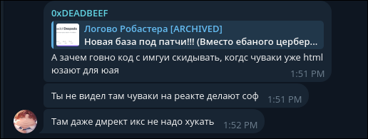

## Despada

Ну комментов от меня особо не будет, просто можете смотреть как пример НОРМАЛЬНОГО хука рендера + UI.

## License

Copyright (C) 2026 ddepsadd

Despada is free software: you can redistribute it and/or modify it under the
terms of the GNU Affero General Public License as published by the Free
Software Foundation, either version 3 of the License, or (at your option) any
later version.

This program is distributed in the hope that it will be useful, but WITHOUT ANY
WARRANTY; without even the implied warranty of MERCHANTABILITY or FITNESS FOR A
PARTICULAR PURPOSE. See the GNU Affero General Public License for more details.

You should have received a copy of the GNU Affero General Public License along
with this program. If not, see <https://www.gnu.org/licenses/>.

`SPDX-License-Identifier: AGPL-3.0-or-later`

Compiled binaries built from this source — including obfuscated, repacked or
renamed ones — are covered works. Distributing them requires shipping the
Corresponding Source under the same license, keeping all copyright and license
notices intact, and preserving attribution.

Third-party components: see [THIRD-PARTY-NOTICES.md](THIRD-PARTY-NOTICES.md).

